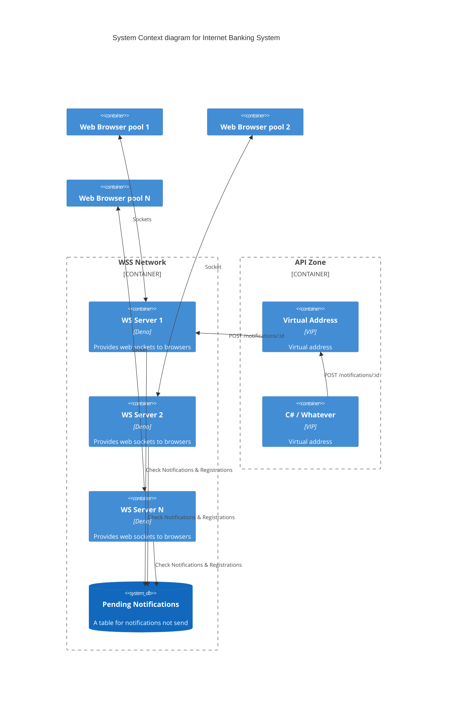

```mermaid
C4Context
   title System Context diagram for Internet Banking System

   Container(userBrowserPool1, "Web Browser pool 1")
   Container(userBrowserPool2, "Web Browser pool 2")
   Container(userBrowserPoolN, "Web Browser pool N")

   Container_Boundary(wssNetwork, "WSS Network", "Network") {
      Container(wss1, "WS Server 1", "Deno", "Provides web sockets to browsers")
      Container(wss2, "WS Server 2", "Deno", "Provides web sockets to browsers")
      Container(wssN, "WS Server N", "Deno", "Provides web sockets to browsers")

      SystemDb(RelayerDb, "Pending Notifications", "A table for notifications not send")

      Rel(wss1, RelayerDb, "Check Notifications & Registrations")
      Rel(wss2, RelayerDb, "Check Notifications & Registrations")
      Rel(wssN, RelayerDb, "Check Notifications & Registrations")
   }

   BiRel(wss1, userBrowserPool1, "Sockets")
   BiRel(wss2, userBrowserPool2, "Socket")
   BiRel(wssN, userBrowserPoolN, "Socket")


   Container_Boundary(Backend, "API Zone", "Internal") {
      Container(vip, "Virtual Address", "VIP", "Virtual address")
      Container(wAPI1, "C# / Whatever", "VIP", "Virtual address")
   }
   Rel(vip, wss1, "POST /notifications/:id")

   Rel(wAPI1, vip, "POST /notifications/:id")
```
