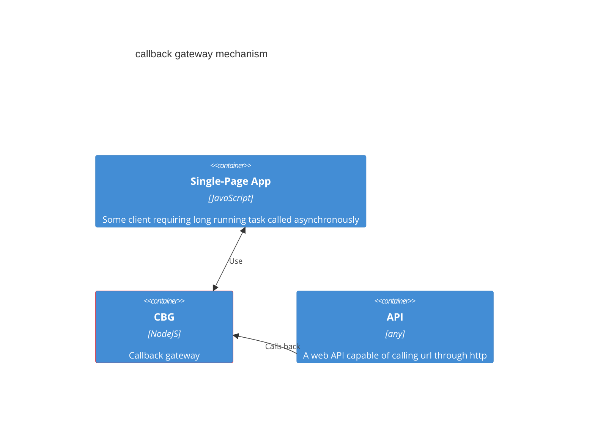

```mermaid
C4Container
    title callback gateway mechanism
    Container(spa, "Single-Page App", "JavaScript", "Some client requiring long running task called asynchronously")
    Container(CBG, "CBG", "NodeJS", "Callback gateway")
    Container(API, "API", "any", "A web API capable of calling url through http")

    UpdateElementStyle(CBG, $borderColor="red")
    BiRel(spa, CBG, "Use")
    Rel(API, CBG, "Calls back")
```
