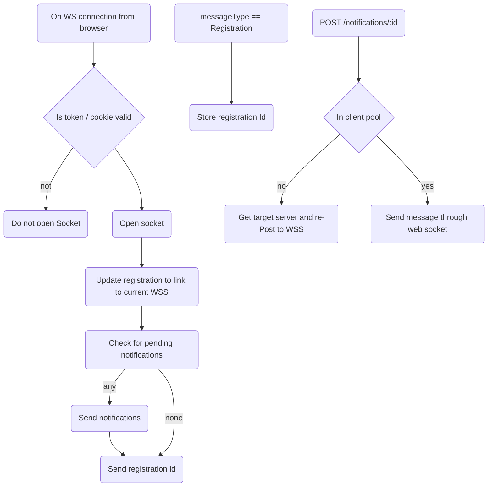

```mermaid
flowchart TD
    onConnection("On WS connection from browser") -->
    checkAuth{Is token / cookie valid} -- not -->
    rejectConnection("Do not open Socket")
    checkAuth{Is token / cookie valid} -->
    openConnection("Open socket") -->
    updateRegistrations("Update registration to link to current WSS") -->
    checkPending("Check for pending notifications") -- any -->
    SendNotifications("Send notifications") -->
    sendRegistrationId("Send registration id")
    checkPending("Check for pending notifications") -- none -->
    sendRegistrationId

    onBrowserReceived("messageType == Registration") -->
    storeRegistrationId("Store registration Id")

    handlePostNotification("POST /notifications/:id") -->
    inClientPool{"In client pool"} -- no -->
    redirectNotification("Get target server and re-Post to WSS")
    inClientPool -- yes -->
    sendThroughWebSocket("Send message through web socket")
```
