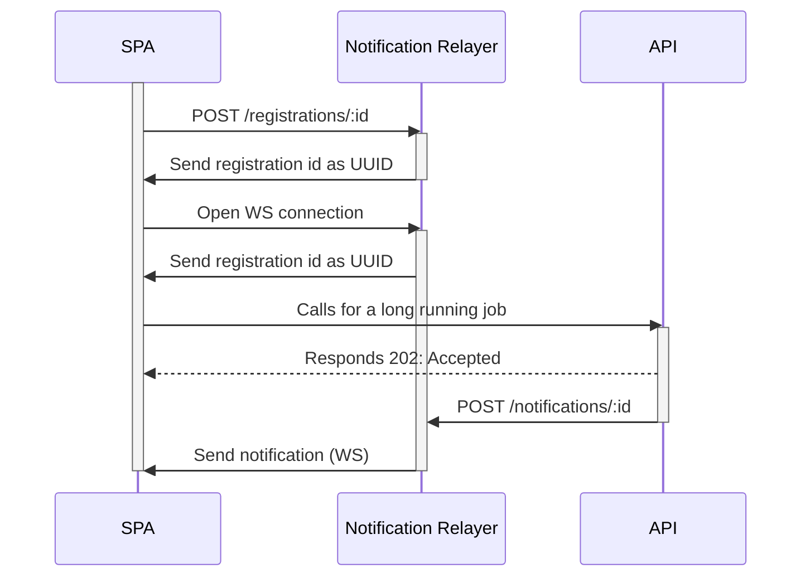

```mermaid
sequenceDiagram
    participant SPA
    participant CBG as Notification Relayer
    participant API

    activate SPA
    SPA->>CBG: POST /registrations/:id
    activate CBG
    CBG->>SPA: Send registration id as UUID
    deactivate CBG
    SPA->>CBG: Open WS connection
    activate CBG
    CBG->>SPA: Send registration id as UUID
    SPA->>API: Calls for a long running job
    activate API
    API-->>SPA: Responds 202: Accepted
    API->>CBG: POST /notifications/:id
    deactivate API
    CBG->>SPA: Send notification (WS)
    deactivate SPA
    deactivate CBG
```
