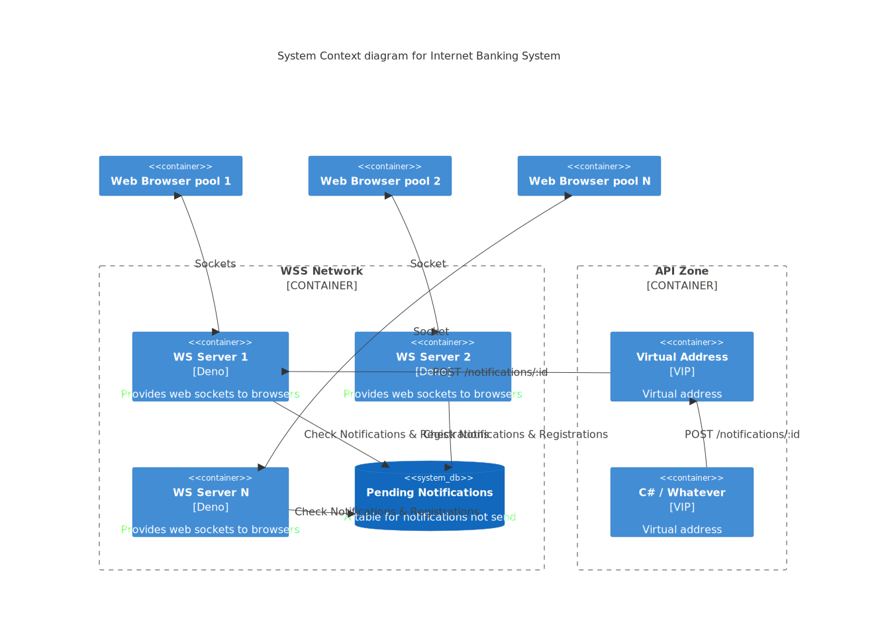
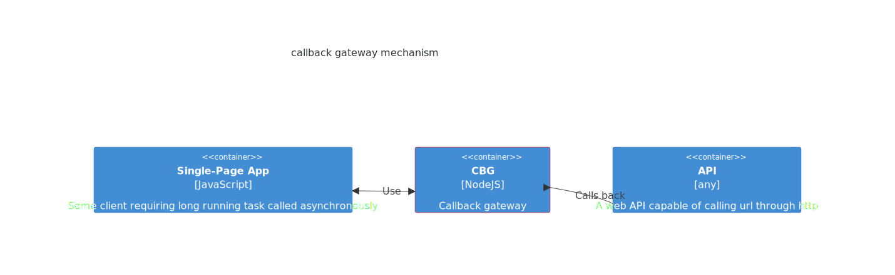
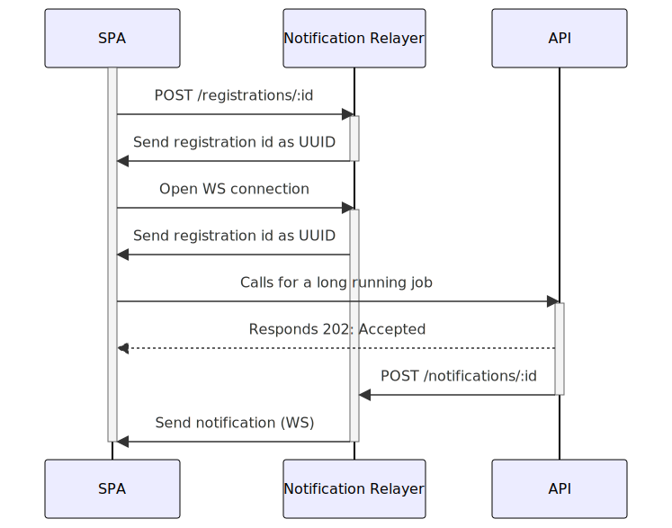

# Callback Gateway

A gateway to let long running tasks call back web browsers through a push server mechanism.


## Overview

Motivation: we do not want to implement server push and session management on APIs that are intended to be stateless (REST API). The callback gateway is here to maintain deported state to manage server push.

### Web Socket Server Network



Notes: each `WebSocketServer` may call other to redirect calls to relevant instance of `WebSocketServer`.

### Web Socket Server Simplified view

Containers



### Registration and notification mechanism

Sequence



### Open Web socket

Flow chart




Notes:

* API which do the actual work must accept a callback URL
* Callback URL is formed as `{ws host domain}/callback/{websocket UUID}`

We can imagine some alternative regarding security and authentication:

1. WebSocket server does not handle any authentication and
   1. Remove connection if not push has been proceed from backend API for the registration id
   2. Does not follow data but only send notifications
2. WebSocket rely on token and
   1. Must validate authentication from backend API
   2. Follow data or send notifications

## Consideration on resilience and scalability

WSS can live behind a virtual address to ensure no SPOF and scalability. But each WSS has its own pool of clients to send messages to. If server A fails abruptly (without properly releasing sockets handles) another server has to relay notifications. On the other side, the client is expected to retry to establish a connection. It may succeed on WSS B. But during this time, an backend API may have called WSS VIP to notify clients. We can circumvent this use case by setting several counter measures as:

* Setup a database which stores pending notifications. A WSS B receiving a notification from API will not be able to follow notifications to a client because the client (recipient) is not in B’s pool of clients. So, it has to register the notification in the DB table PENDING_NOTIFICATIONS
* Each time a client opens a connection to a WSS, the WSS searches for pending notifications to send to the client
ClientId is a UUID given at first connection of a client. Each time a client tries to re-open a connection it must resend its clientId for the WSS to be able to follow pending notifications
* Each WSS has its in memory set of client identified as a webSocket
* Each time a WSS receives a notification from API, it checks if client recipient is in its client pool. If not it searches in DB in table REGISTRATIONS where lies WSS adress, WSS id alongside with every clientId in its pool. If received notification is not in WSS pool, it searches the recipient and call it directly (same network) to send the notification. If it is timed-out, notification is registres in PENDING_NOTIFICATIONS. No matter on which WSS client registers, WSS will search PENDING_NOTIFICATION table


Notification Relayer works in a __network of relayers__ to ensure reliability, scalability and resilience.
Each instance is able to talk to another.


## Data model preview

WSS table

* id: string, the server id, primary key
* address: string, the server's url

REGISTRATIONS table

* clientId: UUID, id of the client / registration, primary key
* serverId: string, name of the server instance

PENDING_NOTIFICATIONS table

* clientId: UUID, unique

## Implementation

For the sake of simplicity and reactivness, [Deno](https://deno.com/) has been choosen as a runtime using [Postgres SQL](https://www.postgresql.org/) as database server.

The notification relayer is run in demo as a network running in [Docker](https://www.docker.com/).


## Getting started

Start a single "node" of notification relayer for developping purpose:

```bash
deno run -A --watch src\index.ts
```

* WebSockets https://masteringjs.io/tutorials/express/websockets

* From MDN doc
[Push API](https://developer.mozilla.org/en-US/docs/Web/API/Push_API)
* [Web-Push package](https://www.npmjs.com/package/web-push) relates Google Cloud Messaging
* [websockets-with-deno](https://blog.logrocket.com/using-websockets-with-deno/)
* needs a script included in client

From google push service
* [Tutorial WebPush in ExpressJS](https://web.dev/articles/push-notifications-server-codelab?hl=fr)


## Docker

Using docker compose. Database and WSS expose port to host (see docker-compose.yml).

### Database server

```bash
docker-compose --project-name test-relayer --file .\docker-compose.yml up relayer-database
```

Using postgres SQL (better support from deno)

https://hub.docker.com/_/postgres/

https://stackoverflow.com/questions/37694987/connecting-to-postgresql-in-a-docker-container-from-outside


Set a network

```bash
docker network create some-network
```

Run server (on a network, port binded on host for dev commodity)

```bash
docker run --name some-postgres -e POSTGRES_PASSWORD=mysecretpassword --network some-network -p 5432:5432 -d postgres
```

Connect with client

```bash
docker run -it --rm --network some-network postgres psql -h some-postgres -U postgres
```


<!--
```bash
docker build -t mssql-notification-relayer ./database
```

```bash
docker run -e 'ACCEPT_EULA=Y' -e 'SA_PASSWORD=StrongPassw0rd' -e "MSSQL_PID=Express" -p 1433:1433 --name mssql-notification-relayer.localtest.me --detach mssql-notification-relayer
```
(login: sa) -->